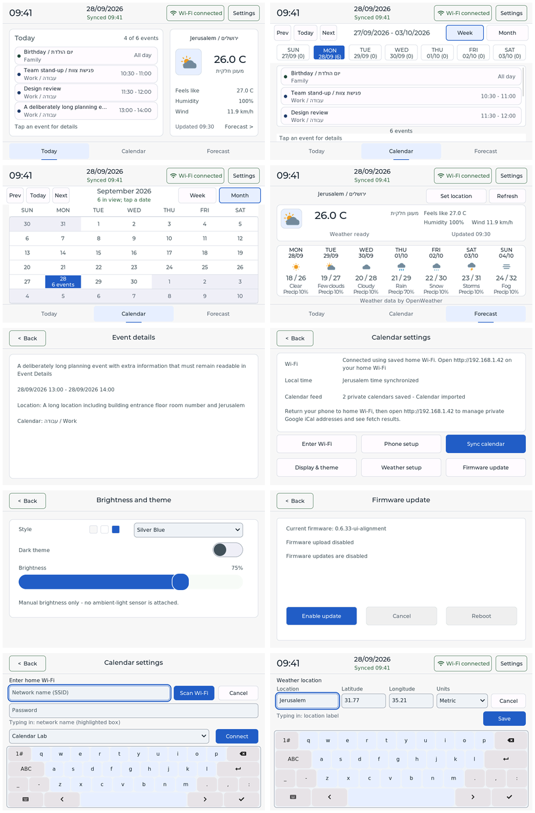
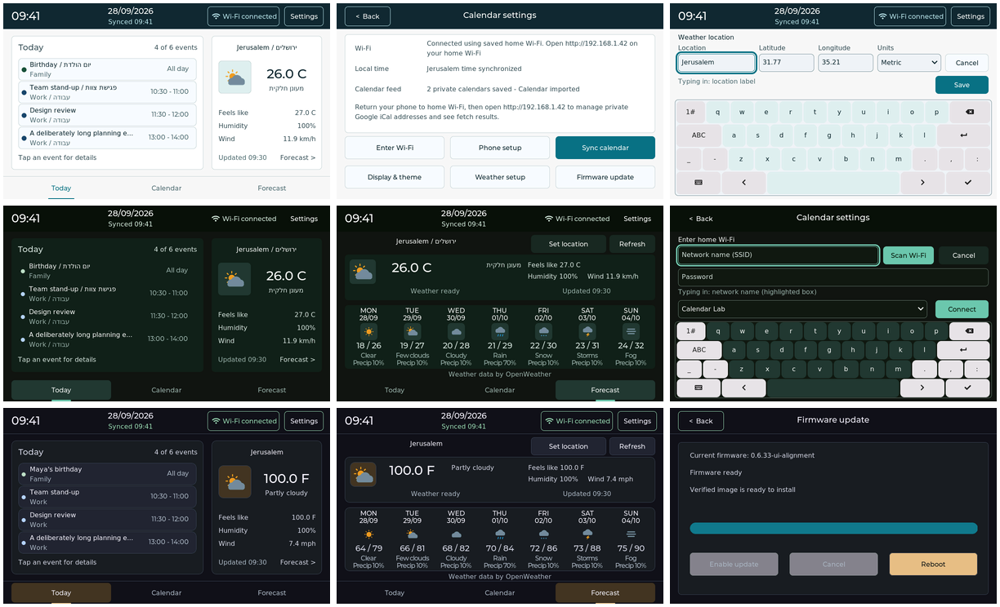

# UI alignment fixes — 0.6.33

Implements all eleven findings in the [alignment audit](../alignment_ux_audit_2026-09-28.md) on top of `0.6.32-balanced-ui`. The editable EEZ source owns static geometry; the controller owns runtime content and styles. EEZ Studio 0.28.0 regenerated eleven files with zero errors/warnings.

| Finding | Implemented behavior | Verification |
| --- | --- | --- |
| A1 | Neutral status uses header ink. | All 16 appearances pass; minimum final RGB565 contrast is 13.82:1. |
| A2 | Settings values center beside their captions after content measurement. | Center delta 0; single/two-line changes and missing values exercised. |
| A3 | Units choices are Metric / Imperial. | Text and dropdown arrow fit both choices. |
| A4 | Location, Latitude, Longitude and Units have persistent captions. | Filled fields retain labels and clear the keyboard. |
| A5 | Forecast current conditions share one summary card and status baseline. | Native layout checks and light/dark captures. |
| A6 | Single-label buttons use Montserrat 16 and content-based centering. | 608 samples, maximum 0.5 px horizontal / 0 px vertical offset; no pressed-state shift. |
| A7 | Event/source rows use a consistent left anchor with automatic bidi direction. | Mixed Hebrew/English rows pass; Details retains automatic direction. |
| A8 | Week shows three complete event rows. | 186 px viewport, 54 px rows, 60 px stride, 5 px vertical padding. |
| A9 | The valid Firmware action receives primary emphasis. | Disabled / Armed / Ready states select Enable / Cancel / Reboot respectively. |
| A10 | Month headers follow actual table columns; Forecast columns account for themed borders. | Month centers match; Forecast outer margins are 9 / 9 px in every appearance. |
| A11 | Wi-Fi feedback, scan picker and keyboard have explicit spacing. | 8 px keyboard clearance; four effective 44 px key rows. |

Weather entry has 14 px clearance above its keyboard. Form fields have explicit 44 px height so LVGL's one-line textarea sizing cannot expand them into adjacent rows. Long feedback uses an overflow indicator. List deletion restores a representable scroll position (8 → 8 px) and clamps it when only three rows remain (40 → 0 px).

## Native captures

These are actual 800 × 480 LVGL 9.2.2 RGB565 renders of the generated UI and controller, with desktop service/clock/storage fixtures. Contact sheets are scaled for browsing; individual PNGs retain native resolution.

Native captures: [Silver Blue light](captures/theme-4-light/today.png), [Silver Blue dark](captures/theme-4-dark/today.png), [Forecast](captures/theme-4-light/forecast.png), [Settings](captures/theme-4-light/settings.png), [Weather form](captures/theme-4-light/weather-form.png), [Wi-Fi form](captures/theme-4-light/wifi-form.png). Each representative directory contains all 27 captures.

## Verification

The target build and all six host suites pass. [Matrix results](checks/matrix-results.txt) and per-run checks cover eight themes in both modes (16 runs, zero failures). Each run exercises 80 warmed navigation/theme cycles: object count 323 → 323 and desktop LVGL allocator use 192144 → 192192 bytes (+48 bytes). Native pointer size and fixture rows differ from production; these figures do not measure ESP32 heap/PSRAM or prove hardware stability.

The preview-only fixtures exercise OTA action eligibility and Wi-Fi scan results without performing network, storage or firmware I/O. They are excluded from PlatformIO firmware. See [preview commands and coverage](../../tools/ui_preview/README.md) and [exact build commands](../verification.md).

Changed production sources: `ui/calendar.eez-project`, generated `screens.h` / `screens.c`, `src/app/ui_controller.cpp` and `include/app/firmware_version.hpp`. Preview-only changes: `preview.cpp`, `services.cpp`, `fixtures.hpp` and its README under `tools/ui_preview`. The [source boundary](source-change-boundary.json) compares 114 production/build files to the saved before-state. Board profile, display driver, initialization, LVGL configuration, networking and service code are unchanged.

Candidate: [release package](../../artifacts/releases/0.6.33-ui-alignment/README.md). The earlier candidate and accepted physical checkpoint are preserved. No firmware was uploaded or observed on hardware. The remaining acceptance pass is to inspect these screens and forms on the physical panel, including touch corners, manual brightness persistence, colors, scrolling and display artifacts/flicker.
